Desarrollo del laboratorio 4

4.2. Clic en el botón Crear
4.3. Complete los datos del nuevo Cliente:
Imagenes:

4.6. Asignar una imagen al nuevo cliente. Clic en la herramienta Editar (Forma de Lápiz)

4.10. Cargue nuevamente la lista de todos los clientes y verifique que se muestre el cliente que acaba de crear:

5.Equipo de Ventas - Equipo de ventas directas

5.11. Clic en el botón Guardar para finalizar la creación de los miembros del equipo:

6.Iniciativas y/o oportunidades en ODOO (Leads)
6.2. Adicionar manualmente un contacto.
    Verifique en la opción de Clientes que se muestra el nuevo Contacto generado:

6.3. Crear una nueva oportunidad
6.3_4.A continuación se muestra los datos del nuevo Cliente y los datos de un nuevo contacto asociado al cliente.
    
6.3_7.Verifique que en la vista Kanban se muestre la nueva oportunidad creada
    

7.Generar iniciativas desde el sitio web de ODOO
7.6. Clic en el botón Guardar para finalizar la edición
    
7.10. Adicione un nuevo Contacto empleando el formulario anterior. Clic en Enviar
    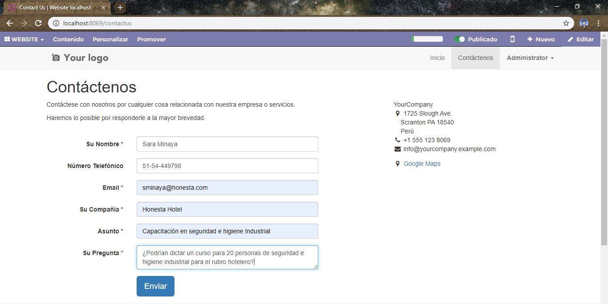
7.11. Debe visualizar un mensaje de confirmación de la creación del contacto:
    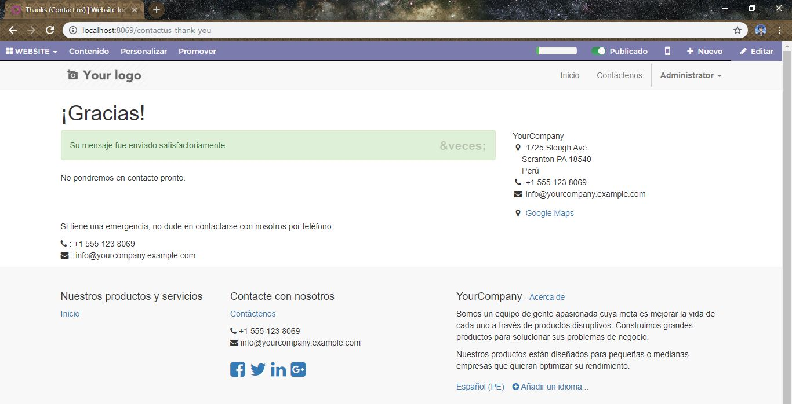
7.12. Regrese nuevamente al módulo CRM. Elija la opción del tablero Ventas → Iniciativas y verifique que se muestre el nuevo contacto captado por medio del sitio web
    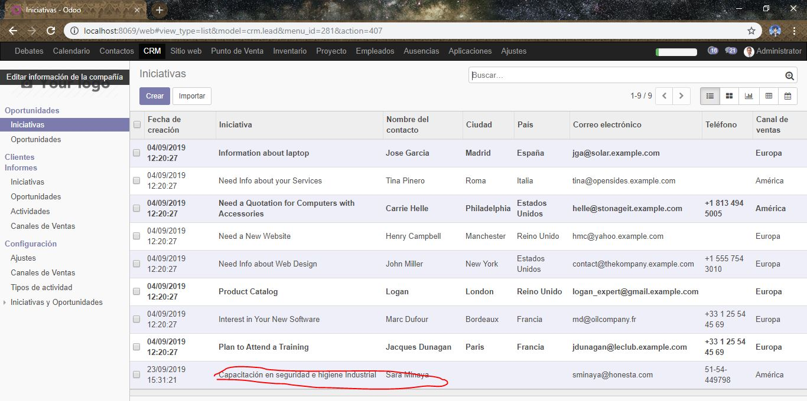
7.15. Elija la opción “Flujo de ventas” y verifique que se visualiza la nueva oportunidad:
    

TAREA 7.17
7.17. Aplicando el ejercicio anterior crear 2 nuevas oportunidades empleando el formulario de contacto (adjunte imágenes de los datos ingresados en el formulario contáctenos, adjunte imágenes de la vista Kanban donde se visualicen las 2 nuevas oportunidades)

Secuencia de creacion de oportunidades
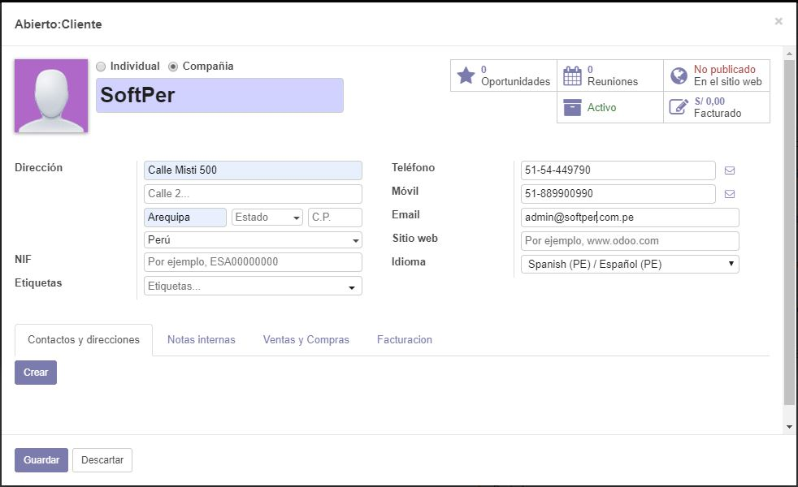
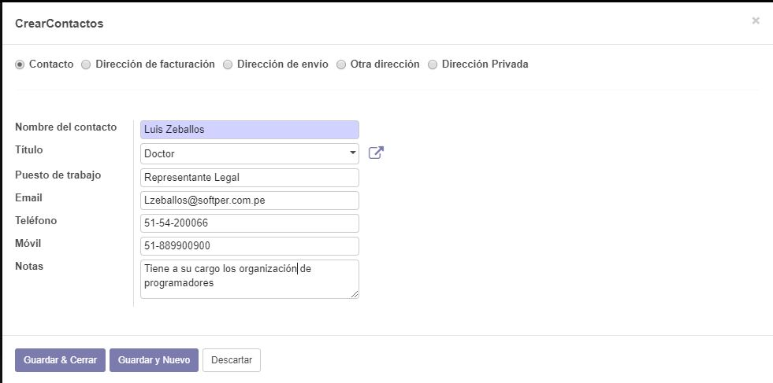
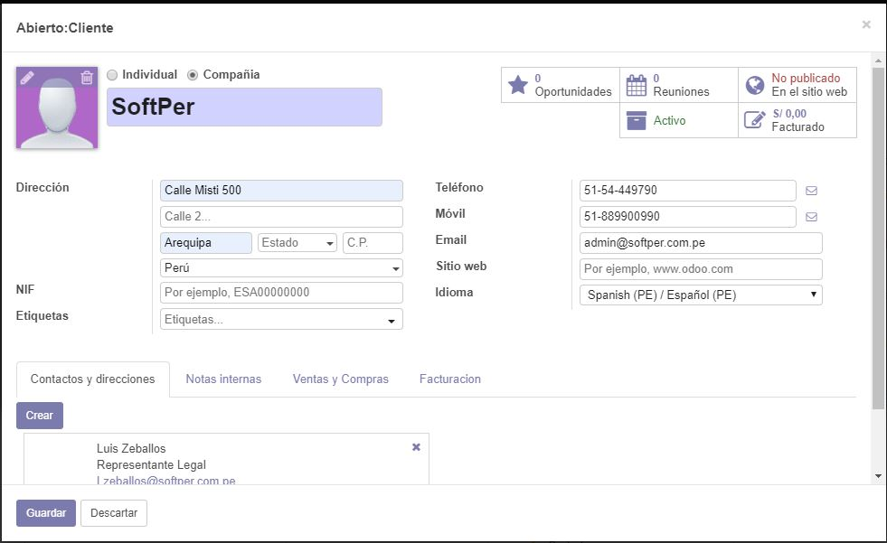
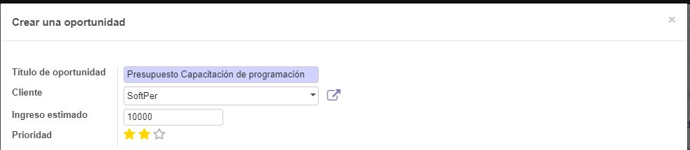

Vista de las dos oportunidades
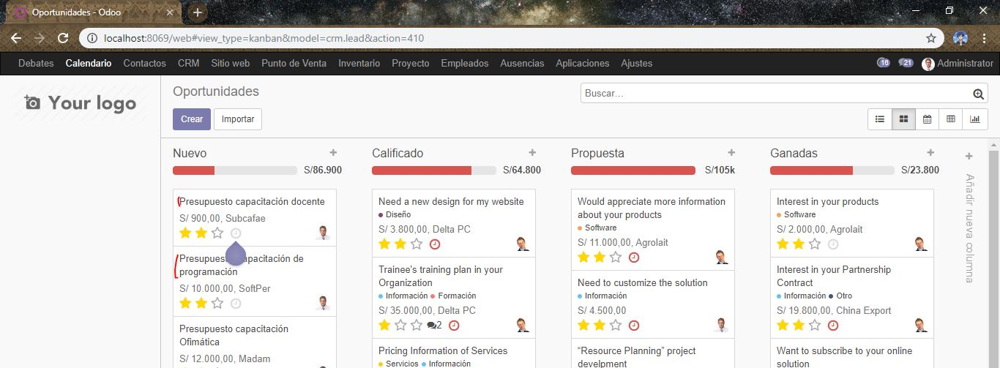

TAREA PROPUESTA
1.Describa el procedimiento para importar contactos/clientes desde un archivo CSV (revise la documentación)

2.Mejore la presentación del módulo Website instalado adicionando mayor cantidad de elementos disponibles en su editor. Adjunte imágenes del resultado obtenido.

Capturas
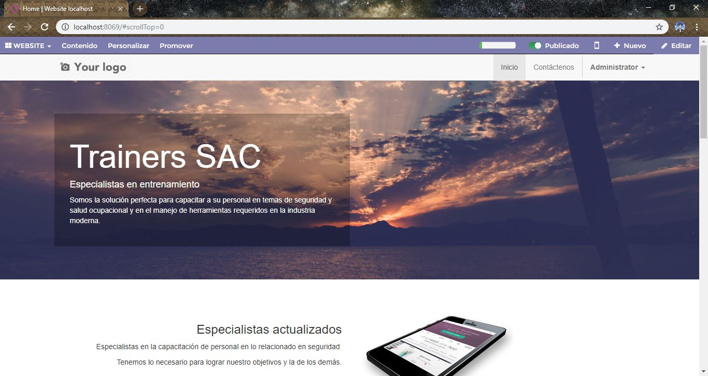
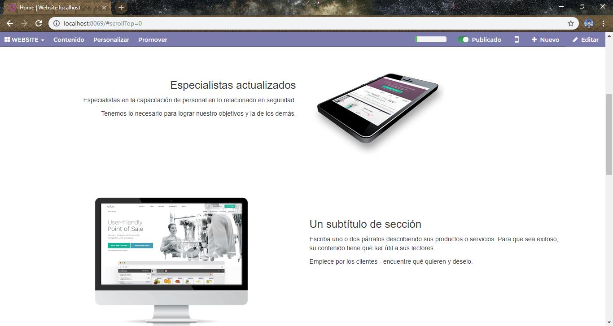
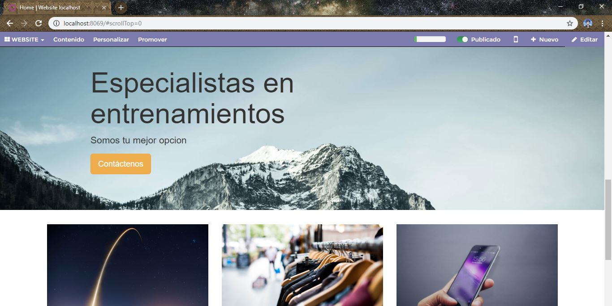
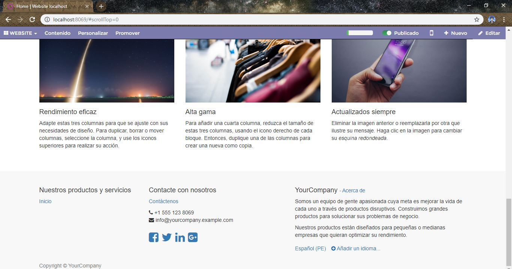

Observaciones y Conclusiones

- Con Odoo la gestión de Relaciones con los Clientes se utiliza para definir una estrategia de negocio enfocada al cliente, cuyo objetivo es reunir la máxima información posible sobre sus clientes, generar relaciones a largo plazo y aumentar su grado de satisfacción.

- Se podra gestinar las iniciativas de Marketing, las oportunidades comerciales de los clientes potenciales y la manera de generar relaciones con ellos.

- Se podra clasificar las propuestas entre su equipo comercial, obtenga un seguimiento sencillo, y visual por etapas de venta, y visualice informes de ventas por cuenta, comercial y zonas, todo ello integrado completamente con el resto del ERP. 

- Todos los presupuestos generados en el laboratorio podrán ser convertidos a pedidos, factura y se contabilizarán automáticamente.

- Con ODOO tiene el CRM más completo y avanzado una empresa y sin costes de licencias. 