Laboratorio 04

2.Configuración de Almacenes

2.11. Al darle click en Guardar y Cerrar, veremos que dicho contacto ha sido añadido a la pestaña de Contactos y Direcciones dentro de My Company.

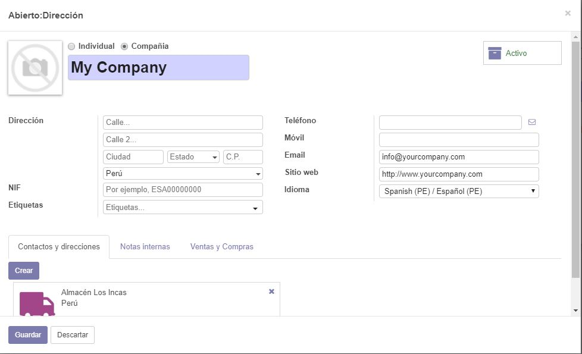

2.12. Demos click en guardar para volver a la edición del almacén. Ahora, al hacer click nuevamente en My Company, el menú desplegable mostrará la opción de Almacén Los Incas, que es la denominación que le dimos a nuestro almacén secundario.

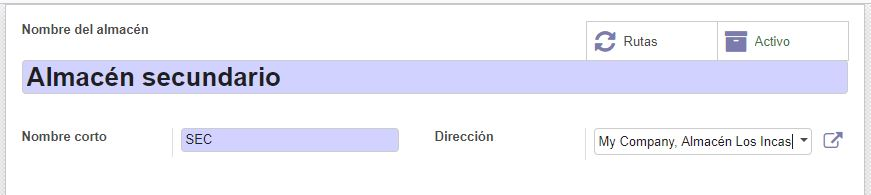

2.13. Así mismo, veremos que se han creado automáticamente rutas para dicho almacén. Si uno desea modificarlas, puede entrar directamente a ellas o incluso crear una ruta nueva.

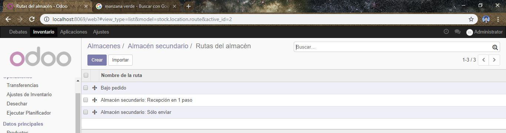

3. Tipos de operaciones

3.2. Estas son las operaciones permitidas por el sistema. Uno puede restringir a un usuario a solamente realizar ciertas operaciones o tener acceso a todas, dependiendo del almacén en el que trabajan. Haremos click en Recepciones del Almacén secundario para ver un poco más el detalle.

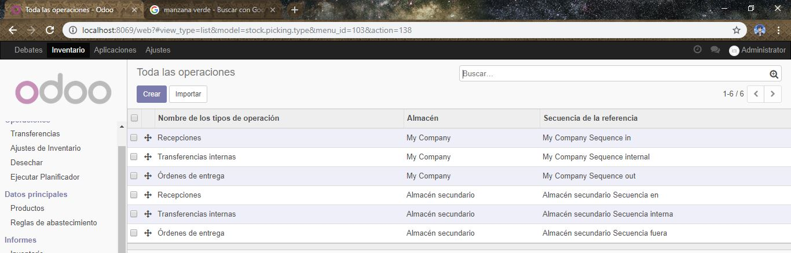

3.3. Lo interesante de los tipos de operaciones es que ya tienen personalizadas las ubicaciones de origen y destino. En este caso, solamente indica la de destino como el almacén secundario, indicando que esta operación permite trasladar un producto de cualquier lugar al almacén secundario

4. Gestión de Productos

4.6. Crearemos el producto manzana verde con los siguientes datos.

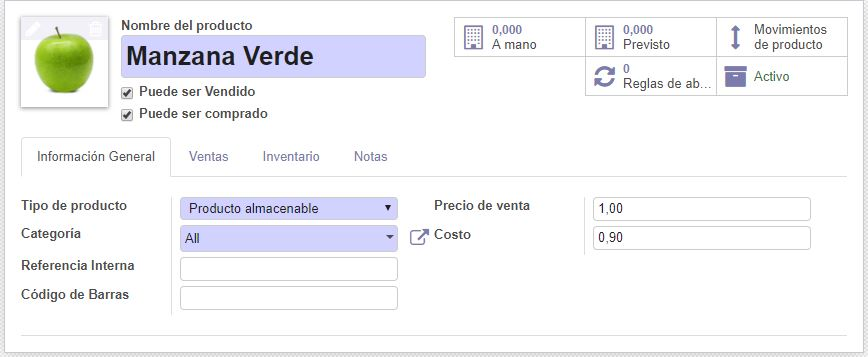

4.9. Otras opciones que tenemos dentro de la ficha del producto son la impresión de etiquetas, útiles para pegar en los anaqueles de venta.

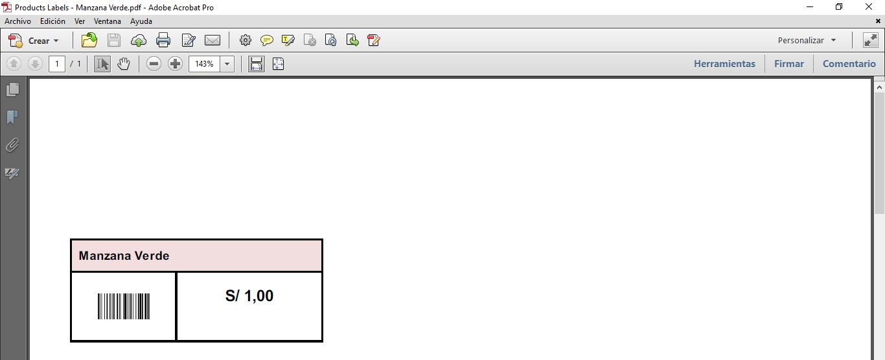

4.10. La opción de Movimientos de producto, nos permite rastrear cada traslado de dicho producto ya sea entre almacenes o salidas del mismo.

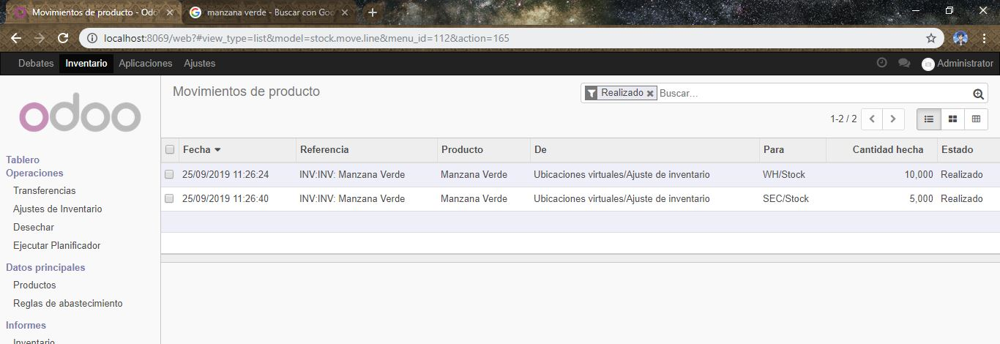

6. Ajustes de inventarios.

6.6. Hagamos click en Validar inventario para asentar dichos movimientos.

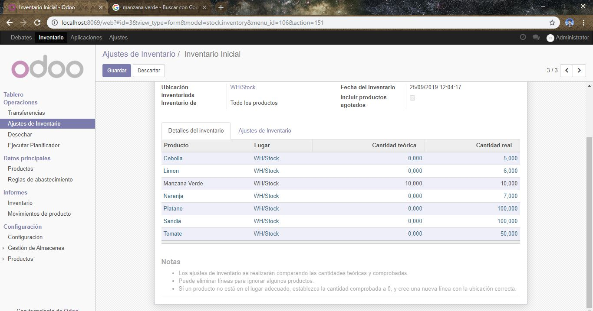

6.7. Al volver a la vista de productos, veremos reflejado el ajuste al ver los nuevos stocks.

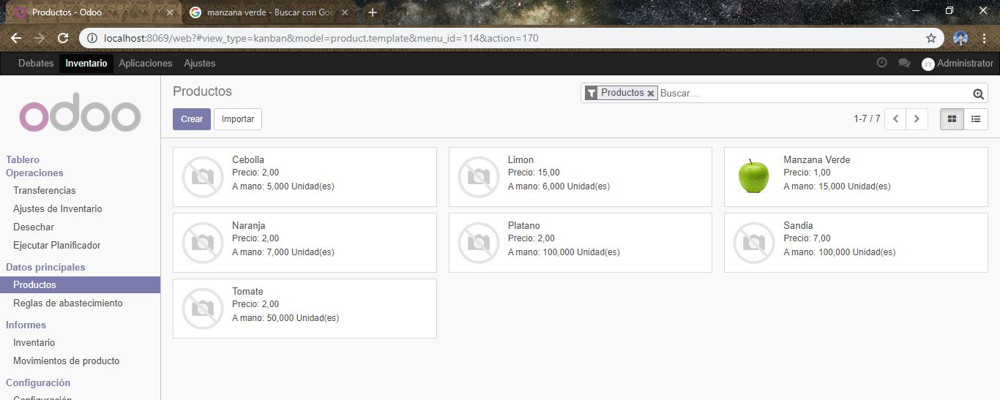

7. Transferencias internas

7.4. Seleccionaremos la opción de transferencias internas desde My Company, y cambiaremos las ubicaciones de origen y destino tal como se muestra en la imagen.

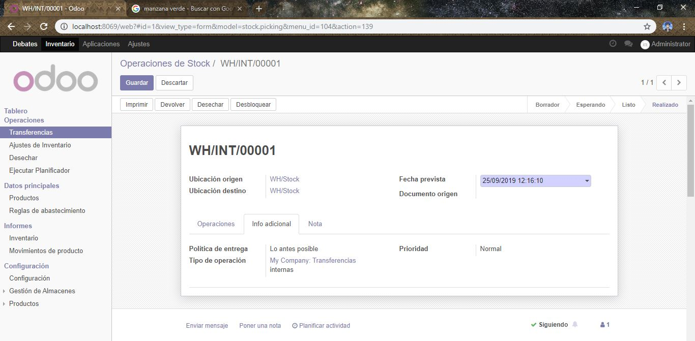

7.5. Demos click en validar para hacer la transferencia válida. Como dato adicional, en la parte inferior de la transferencia, veremos el historial de las operaciones creadas a partir de dicho documento.

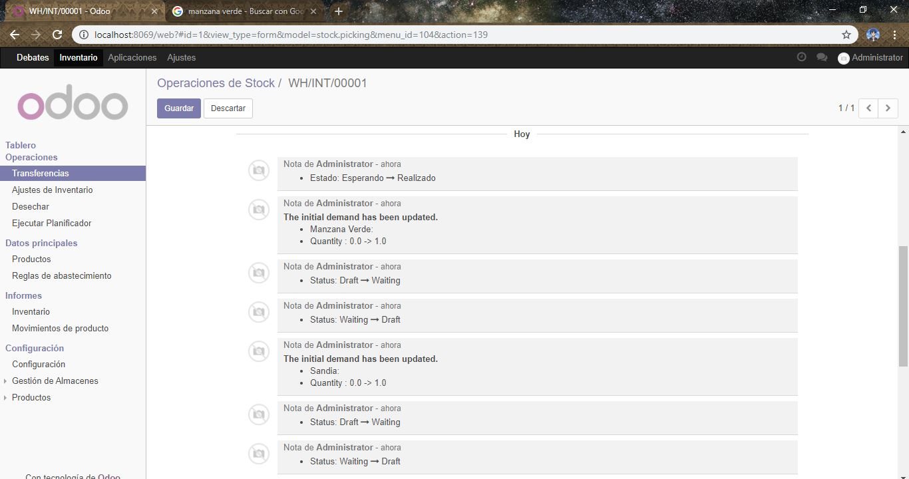

7.6. Vamos a uno de los productos trasladados. Vemos de que el stock sigue siendo el mismo, no ha variado.

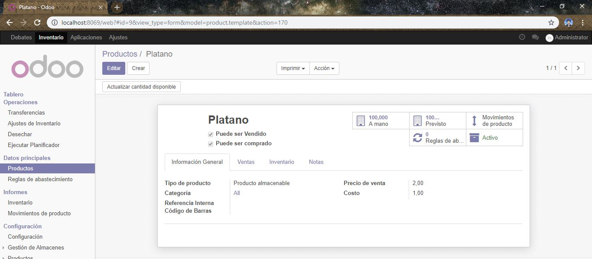

7.7. Sin embargo, al hacer click en Stock a mano, veremos que el stock ahora está repartido en dos ubicaciones, esto debido a la transferencia realizada.

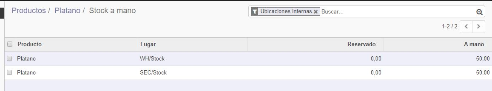

7.8. Cuando hacemos click en Tablero, vemos justamente todas las operaciones en proceso. Esto es útil para poder ver cuantas transferencias hay actualmente en camino a ser concretadas.

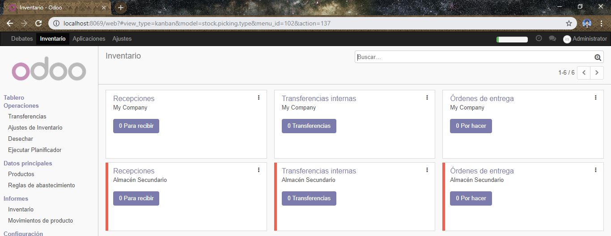

Observaciones y Conclusiones:

