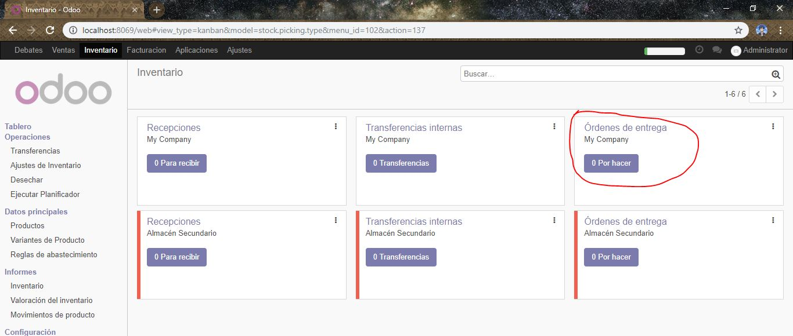
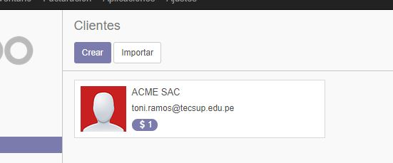
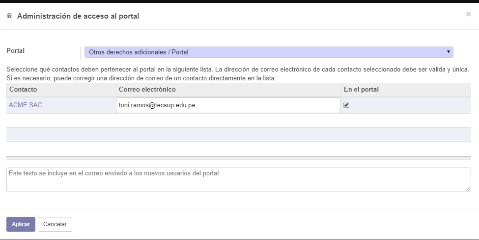

Laboratorio 05
Desarrollo del laboratorio:
2. Creación de Cotización a cliente
2.1. Entramos al menú Cotización y empezamos la creación de una nueva cotización. Podemos apreciar que están los productos creados en el laboratorio anterior.

2.2. Seleccionemos manzanas verdes e intentemos vender 100 unidades. En caso no tengamos stock suficiente, el sistema nos dará una alerta al respecto. Esto es muy útil para la persona que realiza la cotización.

2.3. A pesar de la falta de stock, crearemos la Cotización con al menos dos productos.

2.6. Demos click en Guardar y luego en Validar. Al validar la cotización, aparecerán nuevas opciones, como Enviar por Email, Imprimir o incluso, Confirmar Venta (recordar que esta es solamente una cotización para un cliente interesado en comprar)

2.8. Ahora que hemos ingresado un correo válido para el cliente (para las pruebas, ingrese un correo personal, usaremos el correo de TECSUP más adelante), nos aparecerá un asistente de redacción del correo. Cada vez que intentamos enviar un correo de cierto documento, Odoo precarga una plantilla con texto por defecto, además de adjuntar el documento en formato PDF. Esto permite flexibilidad en el tipo de correo a enviar según el cliente deseado, e inclusive, añadir más adjuntos, digamos, un contrato o una foto del producto.

La cotización pasa ahora a ser un Presupuesto o Pedido de Venta. 

Podemos ver así mismo, las nuevas opciones, como Entrega y Crear Factura

3. Entrega de productos de una Cotización
Capturas

4. Facturación y registro de pago de una Cotización
4.4. Demos click en Validar. Al igual que con otros documentos, aparecerán nuevas opciones en esta factura. Podremos incluso crear un correo con el adjunto de la factura generada para pagar.

4.5. Al haber validado esta factura, se afectará al estado del cliente. Si buscamos en el menú Clientes, veremos que nuestro contacto ahora tiene un indicador de cuantas ventas tiene.

 Al entrar al contacto, vemos el total facturado hasta el momento a dicho cliente. 

E incluso, al hacer click en Imprimir, tendremos un reporte llamado Pagos pendientes, que muestra todo el detalle de deuda del cliente.
4.6. Volvamos a la factura. Ahora demos click en Registrar Pago. Por defecto, se completa el monto para toda la factura y darla por cancelada.

En caso, nos vayan a hacer un pago parcial, ingresamos la cantidad abonada. El sistema se dará cuenta de esto y nos preguntará si debe mantener aún abierta la factura o pagarla totalmente. La dejaremos abierta y validaremos el pago.
Si vemos el detalle de la factura, en la parte de los totales veremos registrado el pago y el saldo pendiente de pago. 
Esto también podremos observarlo en el módulo de Facturación, al ver el comprobante en estado abierto y cuál es el saldo pendiente.

5. Configuración de envío de Correos
5.2. De click en Editar para modificar el servidor de correo. Ingresaremos la siguiente data. Reemplace el correo por el suyo propio de Tecsup y coloque la contraseña que utiliza para iniciar sesión.

5.3. Vamos a la URL https://myaccount.google.com/security y deslicemos la pantalla hasta la opción de Acceso de aplicaciones poco seguras. Demos click en Activar acceso.
Ahora, solamente debemos permitir el acceso a estas aplicaciones

Una vez hecho esto, volvamos a Odoo y probemos la conexión. En caso de ser exitoso, demos click en Guardar.

6. Cambio de secuencia.
6.4. Guarde los cambios de la secuencia y cree otra Cotización. Verá el cambio rápidamente reflejado. Así podemos modificar todas las secuencias del sistema, no solamente las de ventas.

7. Listas de precios
7.3. Proceda a crear otra cotización y juegue con el cambio de Lista de Precio (este campo no estaba activado antes)

8. Portal del cliente
8.3. Le diremos al sistema que este cliente tiene acceso. De click en el check al costado del correo electrónico para poder marcarlo y activarlo.

