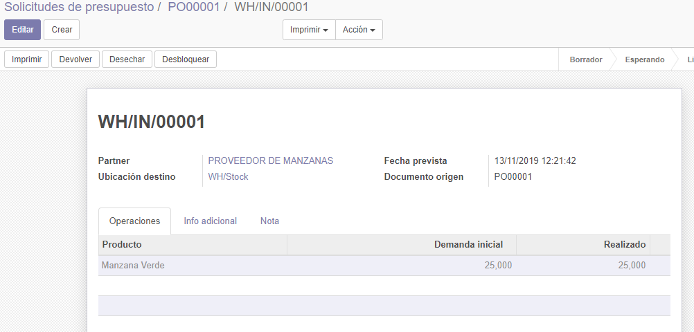
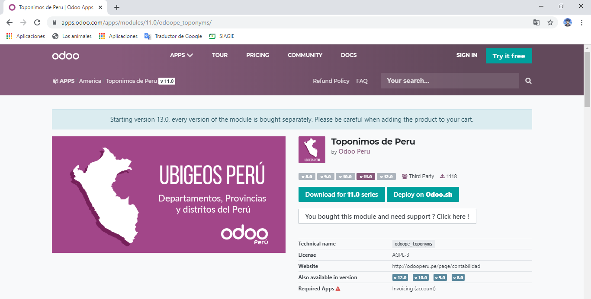
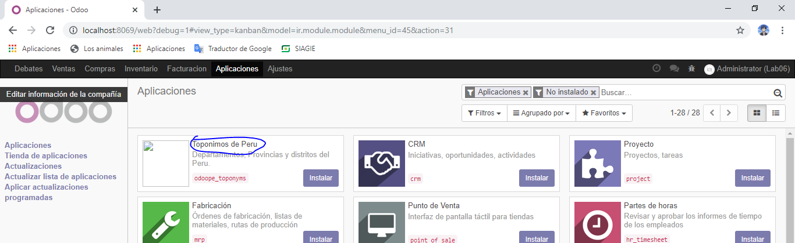

Laboratorio 06

Desarrollo del Laboratorio

2. Creación de Solicitud de presupuesto

2.4. Podemos ver que al crear la solicitud de presupuesto se habilitan las opciones de Imprimir e incluso
enviar por correo electrónico. Adjunte una imagen de cómo luce el correo en su bandeja y el adjunto
generado.

2.6. Validemos la Solicitud de presupuesto y veamos las nuevas opciones habilitadas. Se crea por
defecto un envío (en caso tengamos productos que no sean servicios) y un botón para registro de
las facturas del proveedor.

3. Recepción de compras

3.1. Demos click en el botón Recibir productos. Nos llevará a un formulario de transferencia (como los
vistos en el laboratorio 4 de este curso).

3.2. La transferencia a la que hemos llegado tiene los datos para completar toda la compra de nuestro
proveedor. Hay muchos casos en que nuestro proveedor hace entregas parciales, puede ser la
mitad de mercadería un día, y a la semana siguiente el resto. Odoo contempla esto, y al intentar
crear una entrega parcial, nos preguntará si deseamos confirmarla o darla por completa (sin pedido
pendiente).

3.3. Realice una entrega parcial y luego intente crear la segunda entrega del material solicitado. Se
deberán visualizar ambas entregas en la Solicitud de Presupuesto.

4. Facturación de proveedores

4.1. Proceda a crear una factura en la solicitud de presupuesto. Esta se creará en estado Borrador, así
que podremos editar los datos importantes, como, por ejemplo, la referencia del proveedor (allí irá el
número de la factura del proveedor), la fecha de factura, fecha de vencimiento, etc.
Adjunte una imagen de lo que está dentro de la pestaña Otra información.
Proceda luego a validar esta factura en borrador.

4.2. La factura ahora podrá ser encontrada dentro de la Solicitud de presupuesto o incluso dentro del
menú de Facturación, submenú Compras, Facturas de Proveedor. Fíjese que aparece con un monto
A pagar que es precisamente la deuda que tiene la empresa con el proveedor.

//////////***********EXTRA**********////////////
4.3. Si buscamos los detalles del proveedor (indique como llegó a este formulario) veremos que ahora
aparece en su detalle una compra y una factura de proveedor.
Así mismo, en la pestaña Ventas y Compras del formulario de detalle del proveedor podremos ver
la sección Pagos, donde podremos registrar una cuenta bancaria del proveedor. Registre una
cuenta para dicho proveedor y adjunte una imagen del proceso de creación.
CREACION DE LA CUENTA
Capturas:
- Paso 1

- Paso 2

- Paso 3

- Paso 4

- Paso 5

- Paso 6

- Paso 7

4.4. Procederemos a volver a la factura y pagarla. Al igual que en el caso de las facturas de venta,
veremos cómo se registra el pago en la parte inferior de la misma.

5. Tarifas de proveedores

5.1. Vamos a la ficha de detalle de alguno de los productos adquiridos. Veremos que automáticamente
Odoo ha registrado dentro de la pestaña de Compras el proveedor del mismo y el precio al que nos
lo ha entregado. Esta información sirve para hacer una comparación rápida entre proveedores.

5.3. Se habilitará entonces un menú de Tarifas de Compra, en el que podremos establecer distintos
precios para un mismo proveedor de acuerdo a las cantidades entregadas.
Adjunte una imagen con las tarifas de un proveedor para la venta de un mismo producto por unidad,
docena, ciento y una tarifa válida para las mismas cantidades pero solamente válida en navidad.

6. Licitaciones

6.4. Después de haber creado nuestra licitación, procedamos a Confirmarla. Veremos que se habilita la
opción de crear un Nuevo Presupuesto. Estas serán las propuestas de nuestros proveedores.

6.6. Al volver a nuestra licitación, veremos cómo se contabilizan todas nuestras propuestas.

7. Módulos de terceros

7.1. Si ingresamos al portal https://apps.odoo.com podremos acceder a todo el catálogo de módulos
creados para Odoo. Hay todo tipo de módulo, de todo rubro, y al mismo tiempo, algunos tendrán un
costo y otros serán gratuitos.

7.7. Ahora si, al buscar el módulo Top Buying products deberá aparecer entre nuestros módulos.
Proceda a instalarlo.

7.8. El módulo que hemos seleccionado nos agrega una opción en Compras llamada Top Buying
Products que nos mostrará un asistente para poder crear un reporte de los productos más vendidos
durante cierto periodo.

/////////////********EXTRA*********/////////////
7.9. Busque en la tienda de Odoo el módulo Toponimos de Perú. Proceda a descargarlo e instalarlo en
su Odoo local. Tenga cuidado de descargar la versión adecuada (en este caso, la versión 11).
Adjunte capturas de los cambios que implementa este módulo.

Capturas

- PROCESO DE INSTALACION

- PROCESO 1

- PROCESO 2

- PROCESO 3

- PROCESO 4

- PROCESO 5

- PROCESO 6

- PROCESO 7

- PROCESO 8

- PROCESO 9

Observaciones y Conclusiones

- Una de las ventajas de la versión Odoo v.11 es la Vista Pivot que veis arriba. Esta vista permite configurar de manera intuitiva (en pocos clicks) tablas con los datos que el sistema tiene a su alcance, lo que nuestros clientes consideran una funcionalidad muy útil que aparece en cada uno de los módulos de Odoo.
- Automatizar procesos en la gestión de compras mediante un ERP supone una gran ventaja competitiva para la empresa.

